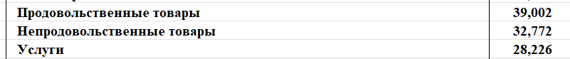
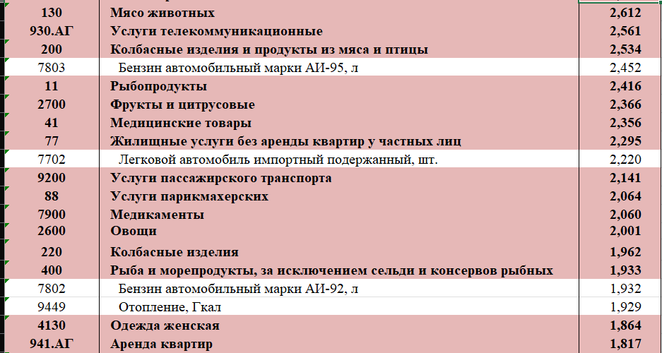
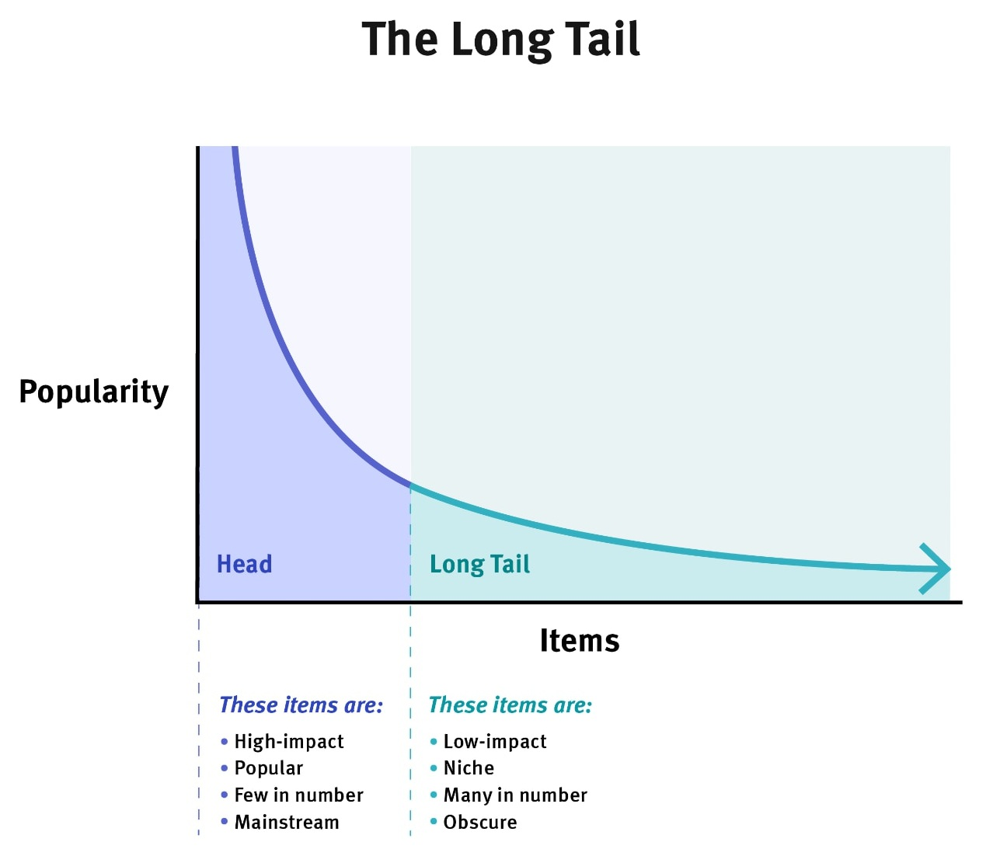

# Explanation of some decisions & Results
## 1. Choosing segments
### 1.1. Data & methods of its proccesing  
First of all, we need to define general categories and their distribution based on official statistics. All my research will be based on statistics of the Russian Federation because the application will be adapted to the russian market.

As we can see in file ***'CPR_Gr_Tov-RF_2026.xlsx'*** that was downloaded from the [Federal State Statistics Service](https://rosstat.gov.ru/statistics/price#), *39.002%* of expenses are food products, *32.772%* of expenses are non-food products, and *28.226%* of expenses are services.

Now we need to get into the details of each category.
To group this data, I manually calculated ratio of each segment like that:

### 1.2. Results

1. **Food** (30-35%). This group has the highest frequency and pretty low average cheque. Examples from this category: meat (8.821%), milk and dairy products (3.117%), pastry (2.693%), etc.
2. **Transport** (4-5%). This segment can be described as the group with high frequency and small sums. These are taxi, travel cards, etc. 
3. **Auto** (8-10%). This category can be described as the group with low frequency and high sums. Plus we should mention that there can be rare situations like an expensive repair so we'll have to count it later.     
4. **Housing and communal services** ($\approx$9.8%). This group has low frequency of expenses (once per month) and fixed sums.
5. **Communications** (3-4%).
6. **Healthcare** (5-7%). This segment can be defined by unregular expenses and volatile cheque.
7. **Clothing and shoes** (8-10%). This category has seasonal spikes. Also there are high volatility, for example, one T-shirt can cost 500 rubles and the other one with famous logo can cost up to 150 000 rubles.
8. **Restaurants & cafe** (5-7%). This group has significant correlation with weekends and holidays.
9. **Entertainment** (3-4%). There is high concentration of anomalies what can be described as high but rare expenses.
10. **Other** (12-17%). This category can be described as the 'Long Tail' of the distribution.

## 2. Distribution
### 2.1. Amount distribution
In this section we need to define a lot of details for different distributions to create a general model based on statistics and probability theory.

First of all, we need to understand what the type of our general distribution is. For that purpose we can find some facts about our 'real' data:
1. **Transactions cannot be negative**. There's no way to send -1500 rubles from one account to another so from the point of the mathematics it will look like that: 

    $X \in [0; +\infin]$, where $X$ - amount (rubles)    
2. **Skewness**. Most of cheques lay around the mean value but there are some expenses placed far away to the right side from the mean value. This distribution looks like that:

Based on these facts, we can use for modeling most of our data **log-normal distribution (PDF)**:

$$\boxed{f(x)=\frac{1}{x\sigma\sqrt{2\pi}}exp(-\frac{(lnx - \mu)^2}{2\sigma^2})}$$, where 

- $\sigma$ - standard deviation of the variable's natural logarithm ($lnX$), 

- $\mu$ - expected value (mean) of the variable's natural logarithm ($lnX$)

***
Now we need to find our real distribution. You can see the process of calculating parameters lower for each category. But before that we should mention what we'll check our calculations by next formula: $\boxed{Median = e^\mu}$.

Also I would like to mention that some numbers will be chosen only by logical sense because the lack of information.

1. **Food**. As declared on this [website](https://www.rsb.ru/press-center/publications/2025/291225/) of one of Russian's bank $E$ = **809** rubles, $max$ = **852** rubles, $min$ = **780** rubles. Let's calculate our parameters:

    $\sigma_f = \frac{ln(max) - ln(min)}{6} = \frac{ln(852) - ln(780)}{6} \approx$ **0.147**

    $\mu_f = ln(E) - \frac{\sigma_f^2}{2} \approx 6.696 - 0.011$ = **6.685**

    $Median_f = e^{6.685} \approx$ **800.31** rubles $\to$ calculations are __correct__.
2. **Auto**. As said on the [website](https://www.banki.ru/news/daytheme/?id=11020468) $E$ = **15000** rubles, $max$ = **97000** rubles, $min$ = **10000** rubles:

    $\sigma_A = \frac{ln(max) - ln(min)}{6} = \frac{ln(97000) - ln(10000)}{6} \approx$ **0.379**

    $\mu_A = ln(E) - \frac{\sigma_A^2}{2} \approx 9.616 - 0.072 =$ **9.544**

    $Median_A = e^{9.544} \approx$ **13960.68** rubles $\to$ calculations are __correct__.
3. **Transport**. I've got some problems with this category because there are not that many researches and statistics about public transport in public sources so I'll use this [website](https://finance.mail.ru/article/issledovanie-muzhchiny-chasche-pokupayut-aviabilety-a-zhenschiny-oplachivayut-taksi-63512180/) to approximate these parameters:

    For the last 2 years inflation in the Russian Federation was about **17.52**% so we should multiply our average value by 1.1752. Also there is another problem with prices for the taxi ($\approx$511 rubles) and public transport ($\approx$121 rubles) so we'll calculate our expected value as

    $E = \frac{511+121}{2} =$ **316** rubles, $max$ = **19376** rubles, $min$ = **121** rubles.
    
    $\sigma_T = \frac{ln(max) - ln(min)}{6} = \frac{ln(19376) - ln(121)}{6} \approx$ **0.846**

    $\mu_T = ln(E) - \frac{\sigma_T^2}{2} \approx 5.756 - 0.356 =$ **5.4**

    $Median_T = e^{5.4} \approx$ **221.41** rubles $\to$ calculations are __correct__.
4. **Housing and communal services**. There is the same problem as with the previous group about lack of public information so I'll use this [website](https://t-j.ru/zakroy-vodu-stat-2025/?utm_referrer=https%3A%2F%2Fyandex.ru%2F) for calculating our parameters:

    $E \approx$ **6800** rubles, $max$ = **10651** rubles, $min \approx$ **4000** rubles

    $\sigma_{HCS} = \frac{ln(max) - ln(min)}{6} = \frac{ln(10651)-ln(4000)}{6} \approx$ **0.163**

    $\mu_{HCS} = ln(E) - \frac{\sigma_{HCS}^2}{2} \approx 8.825 - 0.013 =$ **8.812**

    $Median_{HCS} = e^{8.812} \approx$ **6714.33** rubles $\to$ calculations are __correct__.
5. **Communications**. There are 2 different parts of this group with different behaviour: mobile internet and Wi-Fi. So that's the reason why exactly these values were chosen from this [website](https://3dnews.ru/1127889/kagdiy-rossiyanin-teper-tratit-na-mobilnuyu-svyaz-v-srednem-bolee-1100-rubley-v-mesyats):

    
    $E$ = **1100** rubles, $max$ = **3000** rubles, $min$ = **100** rubles. 

    $\sigma_T = \frac{ln(max) - ln(min)}{6} = \frac{ln(3000) - ln(100)}{6} \approx$ **0.567**

    $\mu_T = ln(E) - \frac{\sigma_T^2}{2} \approx 7.003 - 0.161 =$ **6.842**

    $Median_T = e^{6.842} \approx$ **936.36** rubles $\to$ calculations are __correct__. 
6. **Healthcare**. As declared on this [website](https://sberanalytics.ru/researches/year-results-health-expenses) of the biggest bank of the Russian Federation:

     $E$ = **1293** rubles - average value, $max$ = **8820** rubles, $min$ = **792** rubles.

    $\sigma_H = \frac{ln(max) - ln(min)}{6} = \frac{ln(8820) - ln(792)}{6}\approx$ **0.402**

    $\mu_H = ln(E) - \frac{\sigma_H^2}{2} \approx 7.165 - 0.081 =$ **7.084**

    $Median_H = e^{7.084} \approx$ **1192.73** rubles $\to$ calculations are __correct__.
7. **Clothing and shoes**. As declared on the same [website](https://sberanalytics.ru/researches/year-results-health-expenses) from point 3: 

    $E$ = **7196** rubles, $max$ = **8504** rubles, $min$ = **6738** rubles:

    $\sigma_{cl} = \frac{ln(max) - ln(min)}{6} = \frac{ln(8504) - ln(6738)}{6} \approx$ **0.039** rubles.

    $\mu_{cl} = ln(E) - \frac{\sigma_{cl}^2}{2} \approx 8.8813 - 0.0007 =$ **8.881** rubles.

    $Median_{cl} = e^{8.881} \approx$ **7193.98** rubles $\to$ calculations are __correct__.
8. **Restaraunts & cafe**. There is a lot of information about this category so we'll use information from this [website](https://www.banki.ru/news/lenta/?id=11021070):

    $E$ = **1300** rubles, $max$ = **5000** rubles, $min$ = **150** rubles.

    $\sigma_{RC} = \frac{ln(max)-ln(min)}{6} = \frac{ln(5000)-ln(150)}{6} \approx$ **0.584**

    $\mu_{RC} = ln(E) - \frac{\sigma_{RC}^2}{2} \approx 7.170 - 0.171 =$ **6.999**

    $Median_{RC} = e^{6.999} \approx$ **1095.54** rubles $\to$ calculations are __correct__.
9. **Entertainment**. We'll use information from this [website](https://www.kommersant.ru/doc/8315509):

    $E$ = **3000** rubles, $max$ = **10000** rubles, $min$ = **300** rubles.

    $\sigma_{E} = \frac{ln(max) - ln(min)}{6} = \frac{ln(10000) - ln(300)}{6} \approx$ **0.584**

    $\mu_{E} = ln(E) - \frac{\sigma_{E}^2}{2} \approx 8.006 - 0.171 =$ **7.835**

    $Median_E = e^{7.835} \approx$ **2527.54** rubles $\to$ calculations are __correct__.
10. **Other**. This category can be described as a total spending chaos because every amount which was not categorized as something else mentioned earlier will be here. So we'll have to choose all numbers without any source of information but our own logical sense:

    $E$ = **1500** rubles, $max$ = **20000** rubles, $min$ = **50** rubles.

    $\sigma_O = \frac{ln(max) - ln(min)}{6} = \frac{ln(20000) - ln(50)}{6} \approx$ **0.999**

    $\mu_O = ln(E) - \frac{\sigma_O^2}{2} \approx 7.313 - 0.499 =$ **6.814**

    $Median_O = e^{6.814} \approx$ **910.51** rubles $\to$ calculations are __correct__.
### 2.2. Seasonality & Intensity

Now we should discuss about seasonality and intensity because it's pretty obvious that we cannot make transactions every 5 seconds. So in this sectiong we'll find daily routine, weekly routine and monthly routine for each category mentioned earlier. 

To make our data more realistic let's create some categories of clients, their behaviour, and find weights for each category of transactions for them. For these purposes we'll use information from this [website](https://companies.rbc.ru/news/k2ORyiimZj/kakoj-u-vas-finansovyij-psihotip-i-kak-ego-skorrektirovat/). 

Let's define some variables: 

- $\Phi$ - coefficient of transaction's frequency

- $\alpha$ - coefficient of transaction's amount

#### 2.2.1 Daily routine & behaviour of each psychotype
1. **The Goblin Treasurer**. This type of people cannot live without a thought about saving their own money at any cost. They're conservative and prefer to not borrow at all. They tries to minimize every unecessary expenses. So we've got the next picture of them:

    - $E$ gets closer to the $minimum$ for each category.
    - $Frequency$ will be $minimal$.
    - '**Other**' category will be almost equal to 0. However transactions in '**Restaraunts & cafe**' and '**Entertainment**' would happen at least once per month because of a 'special day', for example, birthday.

2. **The Party King**. These guys doesn't even think about their future. Their slogan is **to live today** so it's all says about their relationships with their money if they still have got one.

3. **The Son of a mom's friend**. This is a perfect client's psychotype because they've got everything under their control: they don't spend any more or less that they need, their balance is always positive, they don't spend money impulsivly, etc. This type of people is really rare but their behaviour is the most predictable through all client's types.

4. **The Unstoppable Player**. We cannot certainly tell how much this type will spend tomorrow: 500 rubles or 500 000 rubles? 

5. **The hypochondriac Survivalist**.

### 2.3. Correlation between Amount and Categories

### 2.4. Fraud detection
This topic is the most important for generating like a real data.  

### 2.5. Literature & Sources